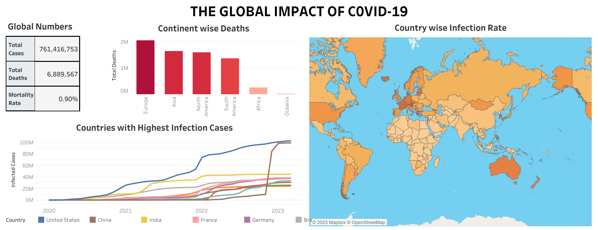

### ABOUT THE PROJECT:

The project is conducted to visualize the global impact of the **COVID-19 pandemic** using **Tableau**. This is the final stage of the analysis. In this project I have utilized publicly available dataset with the aim of generating noteworthy insights pertaining to the magnitude and seriousness of the virus.

The observations obtained from [**data exploration phase**](https://nlaeeq.github.io/Covid19_DataExploration/) and [**data cleaning phase**](https://nlaeeq.github.io/Covid19_DataCleaning/) have been used to create an effective and interactive **COVID-19 dashboard**.

 

### DATASET OVERVIEW:

For this project, I have used [**Coronavirus (COVID-19) Deaths**](https://ourworldindata.org/covid-deaths) dataset, which has been published on Our World In Data website, completely open access under the [**Creative Commons BY license**](https://creativecommons.org/licenses/by/4.0/). This dataset updates on weekly basis and includes values since 3rd January 2020.

**Citation:**

Edouard Mathieu, Hannah Ritchie, Lucas Rodés-Guirao, Cameron Appel, Charlie Giattino, Joe Hasell, Bobbie Macdonald, Saloni Dattani, Diana Beltekian, Esteban Ortiz-Ospina and Max Roser (2020) - "Coronavirus Pandemic (COVID-19)". Published online at OurWorldInData.org. Retrieved from: 'https://ourworldindata.org/coronavirus' [Online Resource]

 

### INITIAL WORKING:

This project will visualize the **Covid-19** data from **3rd January 2020 to 29th March 2023**. As we cannot open the SQL file directly into Tableau, therefore I have saved the results obtained from SQL queries into four different Excel files that I will be using for visualization purpose. The files have been attached in my Github repository.

 

### DATA VISUALIZATION:

The dashboard displays the global confirmed number of Covid-19 cases and deaths, as of March 2023, along with the mortality rate. Besides the global numbers, I have created a bar chart representing the total number of deaths in each continent. 

The data displays the top 10 countries that have highest number of infection cases and it can tell you the month wise situation of those nations from January 2020 to March 2023 by a time-series analysis graph.

On the right side of the dashboard is the entire view of the world map where you can hover over each country in order to view the infection rate with respect to its population.

The data visualization presents a comprehensive overview of the worldwide effects of the pandemic, utilizing a user-friendly format that enables both policymakers and general public to comprehend it with ease.

Below is the picture of the dashboard that I have created.

You can check my dashboard on Tableau. [Here is a link to it](https://public.tableau.com/views/Covid-19DataVisualization_16831468357880/Dashboard1?)

 

**Thank you for reading this project.**

